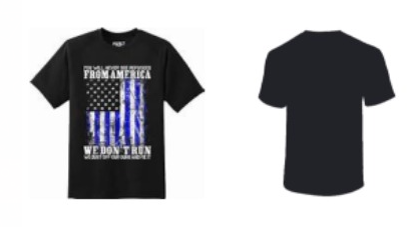
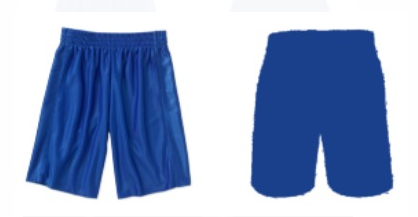
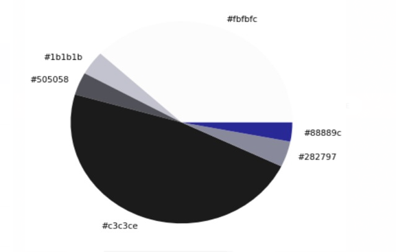

# Brute_Force_Execute2.O

## STEP : 1 - Mediapipe Body Detection:
**If we have full body image of a Model, the face with hands and cordinates of the shoulders must be recorded, we will be using Mediapipe full body detection for this Module**

## K-Means Cluster:

**As we have the front image of the cloth using mediapipe, so with a view to have the backside of the 3D image of cloth we use K-means cluster. 
Here it can generate backside of three types of clothes- T shirt, shorts and trouser.** 

